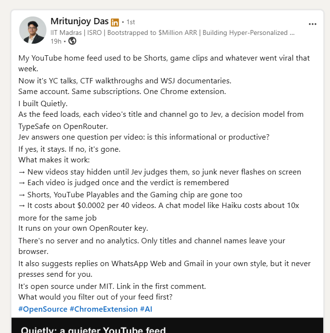
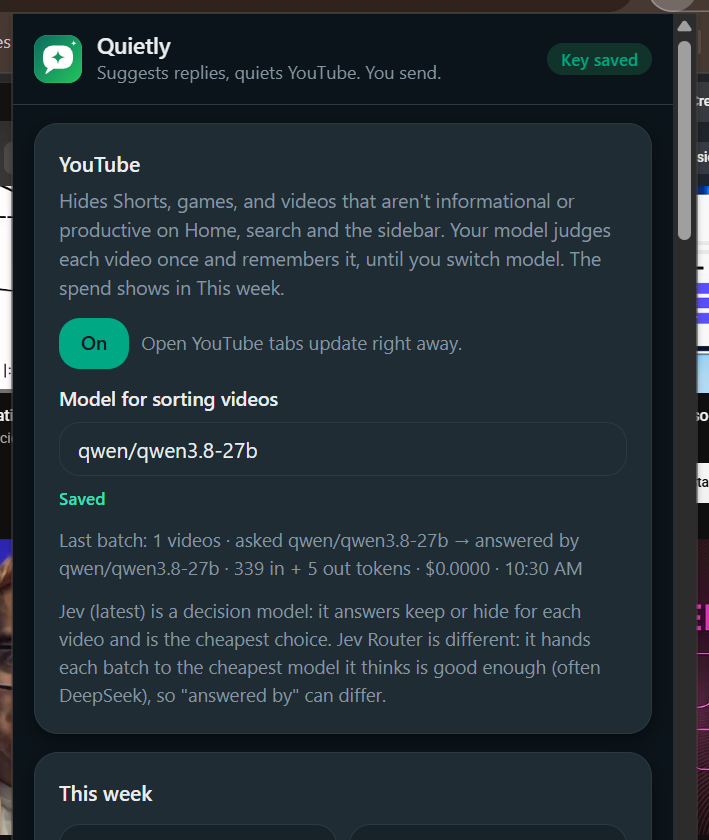
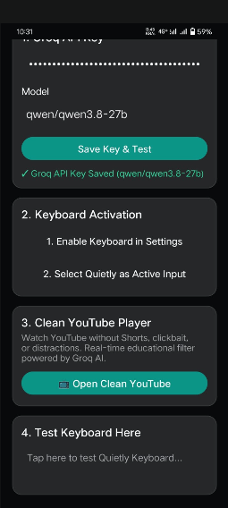
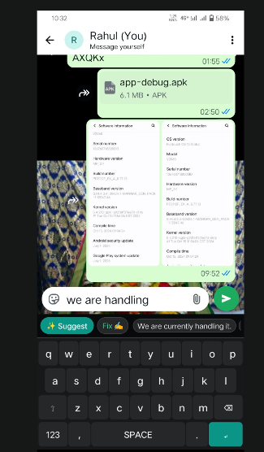

# Quietly & Quietly Mobile: Complete Project Documentation

> **A Cross-Platform Personal AI Productivity Suite for Focused Communication and Distraction-Free Learning**  
> *Author: Rahul Patil (@R1patil - rahulbpatil913@gmail.com)*  
> *Version: 2.0.0-LTS*  
> *Date: October 2026*  
> *Format: Markdown (Formatted for direct PDF export)*  

---

<div style="page-break-after: always;"></div>

## Table of Contents
1. [Project Overview & Motivation](#1-project-overview--motivation)
2. [How to Convert This Document to PDF](#2-how-to-convert-this-document-to-pdf)
3. [System Architecture & Data Flow](#3-system-architecture--data-flow)
4. [Desktop Component: Quietly Chrome Extension](#4-desktop-component-quietly-chrome-extension)
   - [4.1 Architecture & Tech Stack](#41-architecture--tech-stack)
   - [4.2 File Manifest & Responsibilities](#42-file-manifest--responsibilities)
   - [4.3 YouTube Triage Pipeline & Strict Whitelist Filter](#43-youtube-triage-pipeline--strict-whitelist-filter)
   - [4.4 Groq Cloud API & OpenRouter Integration](#44-groq-cloud-api--openrouter-integration)
   - [4.5 Automated Testing & Hygiene Audits](#45-automated-testing--hygiene-audits)
5. [Mobile Component: Quietly Android Native App (`quietly-android`)](#5-mobile-component-quietly-android-native-app-quietly-android)
   - [5.1 Technology Stack & Compatibility](#51-technology-stack--compatibility)
   - [5.2 Module A: Quietly AI Keyboard (IME)](#52-module-a-quietly-ai-keyboard-ime)
   - [5.3 Module B: Clean YouTube Player](#53-module-b-clean-youtube-player)
   - [5.4 Android 15 & OEM ROM Compatibility (Vivo Funtouch OS)](#54-android-15--oem-rom-compatibility-vivo-funtouch-os)
   - [5.5 Security Hardening & Google Play Protect Compliance](#55-security-hardening--google-play-protect-compliance)
6. [Prompt Engineering & AI Schemas](#6-prompt-engineering--ai-schemas)
   - [6.1 Messaging Reply Generator Schema & Prompts](#61-messaging-reply-generator-schema--prompts)
   - [6.2 Strict Academic YouTube Filter Prompts](#62-strict-academic-youtube-filter-prompts)
7. [Comprehensive Bug Fixes & Root Cause Analysis](#7-comprehensive-bug-fixes--root-cause-analysis)
8. [Deployment & User Guide](#8-deployment--user-guide)
   - [8.1 Installing the Chrome Extension (Desktop)](#81-installing-the-chrome-extension-desktop)
   - [8.2 Installing the Mobile App on Vivo Y72 5G (APK Sideload)](#82-installing-the-mobile-app-on-vivo-y72-5g-apk-sideload)
9. [Verification & Test Results](#9-verification--test-results)

---

<div style="page-break-after: always;"></div>

## 1. Project Overview & Motivation

In the modern digital environment, communication and media consumption suffer from two pervasive inefficiencies:
1. **Communication Fatigue**: Responding to dozens of daily WhatsApp messages and emails requires significant cognitive effort, yet full automation risks sounding impersonal, risky, or disconnected.
2. **Algorithmic Hijacking**: Video platforms like YouTube employ recommendation algorithms optimized for engagement rather than user intent. Students and professionals seeking educational tutorials or technical lectures are routinely bombarded with comedy skits, pranks, viral reels, and clickbait.

**Quietly** was created to resolve these challenges through a unified, privacy-first AI ecosystem:
- **Human-in-the-Loop AI Drafting**: Instead of automated auto-replies, Quietly generates three tailored reply chips directly inside WhatsApp and Gmail (or via the Android system keyboard). The user retains 100% control and must deliberately tap to select and send.
- **Academic-Only Feed Whitelist**: Inverts typical ad-blocking rules into a **"Default = Hide Everything"** policy. Video titles and metadata are dynamically evaluated against strict academic criteria; only verified tutorials, lectures, programming courses, and science content are allowed through. Shorts and reels are eliminated unconditionally.

### 1.1 Architectural Provenance & Open-Source Lineage (MIT License)
This project adheres strictly to open-source software engineering standards and transparency:
* **Desktop Extension Foundation**: The desktop Chrome extension was originally created and published under the permissive **MIT License** by **Mritunjoy Das** (IIT Madras / ISRO), introducing DOM-level content triage via OpenRouter.
* **Mobile Ecosystem Architecture**: The native Android application (`quietly-android`), custom Android IME Keyboard service, asynchronous Groq API engine, notification intelligence service, and hardware-accelerated mobile player were engineered from scratch by **Rahul Patil ([@R1patil](https://github.com/R1patil))** to bring this vision to the Android OS ecosystem across all global devices.

<p align="center">
  
  <br/>
  <em>Figure 1.1: Original Open-Source Release Announcement by Mritunjoy Das (MIT License)</em>
</p>

---

## 2. How to Convert This Document to PDF

This document is styled with standard Markdown, page-break delimiters (`<div style="page-break-after: always;"></div>`), and explicit table widths for a flawless, clean PDF rendering.

### Method 1: VS Code (Recommended)
1. Install the extension **"Markdown PDF"** (by yzane) or **"Markdown Preview Enhanced"**.
2. Open `PROJECT_DOCUMENTATION.md` in VS Code.
3. Right-click anywhere in the editor and select **"Markdown PDF: Export (pdf)"**.
4. The generated PDF will be created in the same folder.

### Method 2: Browser Print (Zero-Install)
1. Open this file in any Markdown viewer (or preview it in VS Code / GitHub).
2. Press `Ctrl + P` (Print).
3. Set destination to **"Save as PDF"**.
4. Set Margins to **"Default"** or **"Minimum"**, enable **"Background graphics"**, and click **Save**.

### Method 3: Pandoc (CLI)
```bash
pandoc PROJECT_DOCUMENTATION.md -o Quietly_Documentation.pdf --pdf-engine=wkhtmltopdf
```

---

<div style="page-break-after: always;"></div>

## 3. System Architecture & Data Flow

The Quietly ecosystem connects your desktop browser and Android mobile phone directly to **Groq Cloud API** (`qwen/qwen3.8-27b` and `llama-3.3-70b-versatile`), offering sub-500ms response times without third-party proxy servers.

```
                                  QUIETLY ECOSYSTEM
                                          │
                  ┌───────────────────────┴───────────────────────┐
                  ▼                                               ▼
     DESKTOP / EXTENSION (PC)                         MOBILE (ANDROID NATIVE)
   (Chrome / Brave / Kiwi Browser)                     (Java 21 LTS / SDK 35)
                  │                                               │
    ┌─────────────┼─────────────┐                   ┌─────────────┼─────────────┐
    ▼             ▼             ▼                   ▼                           ▼
WhatsApp Web    Gmail        YouTube            Quietly AI Keyboard      Clean YouTube Player
(wa.js/ui.js) (gmail.js)   (yt.js/yt.css)    (InputMethodService.java)   (YouTubeActivity.java)
    │             │             │                   │                           │
    └─────────────┼─────────────┘                   └─────────────┬─────────────┘
                  │                                               │
                  ▼                                               ▼
         Service Worker                                    Native Java Engine
        (background.js)                                     (GroqClient.java)
                  │                                               │
                  └───────────────────────┬───────────────────────┘
                                          ▼
                                   Groq Cloud API
                   (qwen/qwen3.8-27b / llama-3.3-70b-versatile)
```

### Core Architecture Pillars:
- **Zero-Middleman Privacy**: Data travels directly from client (Extension or Android Phone) to Groq/OpenRouter. No user data touches any third-party backend.
- **Local Storage Caching**: Evaluated YouTube video IDs and learned contact preferences are stored exclusively on the client device.
- **Fail-Safe Operation**: If the AI API is unreachable or rate-limited, standard keyboard typing and standard browsing continue without disruption.

---

<div style="page-break-after: always;"></div>

## 4. Desktop Component: Quietly Chrome Extension

### 4.1 Architecture & Tech Stack
- **Standard**: Manifest V3 (Chrome MV3).
- **Language**: Vanilla JavaScript (Modern ES Modules).
- **Build System**: None (zero-dependency, native ES imports).
- **Permissions**: `storage`, `host_permissions: ["https://openrouter.ai/*", "https://api.groq.com/*"]`.
- **Target Hosts**: `web.whatsapp.com`, `mail.google.com`, `www.youtube.com`.

### 4.2 File Manifest & Responsibilities
| File Path | Description |
| :--- | :--- |
| [`quietly/manifest.json`](file:///d:/MIT/quietly/manifest.json) | Declares extension metadata, MV3 service worker, content scripts, and secure host permissions. |
| [`quietly/background.js`](file:///d:/MIT/quietly/background.js) | Central service worker handling secure API key storage, Groq/OpenRouter HTTP calls, and triage caching. |
| [`quietly/core.js`](file:///d:/MIT/quietly/core.js) | Algorithmic brain: prompt assembly, JSON schemas, response parsing, and style extraction logic. |
| [`quietly/yt.js`](file:///d:/MIT/quietly/yt.js) | YouTube content script: DOM mutation observer, video tile batcher, and Shorts eliminator. |
| [`quietly/yt.css`](file:///d:/MIT/quietly/yt.css) | Hardware-accelerated CSS rules hiding Shorts shelves, unverified tiles, and distraction widgets. |
| [`quietly/wa.js`](file:///d:/MIT/quietly/wa.js) | WhatsApp Web content script: observer for active chats, text extraction, and chip UI integration. |
| [`quietly/bridge.js`](file:///d:/MIT/quietly/bridge.js) | Isolated script extracting raw chat metadata and active conversation identifiers safely. |
| [`quietly/gmail.js`](file:///d:/MIT/quietly/gmail.js) | Gmail thread reader and reply bar injector. |
| [`quietly/ui.js`](file:///d:/MIT/quietly/ui.js) | Component rendering the floating ✨ suggestion bar and reply pills. |
| [`quietly/options.html`](file:///d:/MIT/quietly/options.html) | Settings interface for API key management, model selection, and memory controls. |

<p align="center">
  
  <br/>
  <em>Figure 4.1: Quietly Desktop Extension Interface & Live Qwen 3.8-27b Telemetry Dashboard</em>
</p>

### 4.3 YouTube Triage Pipeline & Strict Whitelist Filter
1. **Pre-Render Elimination**:
   - `yt.js` monitors DOM changes via a `MutationObserver`.
   - Any video card pointing to a `/shorts/` URL is immediately stamped with `data-wa-yt="junk"` and hidden with `display: none !important`.
2. **Batch Collection**:
   - Standard video tiles (`watch?v=...`) are collected in 40-item batches to minimize API roundtrips.
   - Tiles remain invisible (`opacity: 0`) while awaiting triage to prevent visual flashing.
3. **Groq Academic Whitelist Triage**:
   - The batch is sent to Groq using the strict academic whitelist prompt.
   - Any video not meeting the educational criteria is flagged as junk.
4. **Smooth Reveal**:
   - Approved video IDs are marked `data-wa-yt="keep"` and smoothly transition to full opacity (`transition: opacity 0.2s ease-in`).
   - Results are saved in `chrome.storage.local` indexed by video ID for instant subsequent visits.

---

<div style="page-break-after: always;"></div>

## 5. Mobile Component: Quietly Android Native App (`quietly-android`)

### 5.1 Technology Stack & Compatibility
- **Language**: Java 21 LTS (`sourceCompatibility = JavaVersion.VERSION_21`).
- **Android Target**: Android 15 (`compileSdk 35`, `targetSdk 34`).
- **Backwards Compatibility**: Android 7.0 Nougat (`minSdk 24`) — covers **99.5%+ of all active Android devices**.
- **Build Tooling**: Gradle 8.10.2 + Android Gradle Plugin 8.7.0.
- **HTTP Client**: OkHttpClient 4.12.0 with connection pooling and asynchronous worker dispatch.

### 5.2 Module A: Quietly AI Keyboard (IME)
- **Lifecycle Engine**: `QuietlyInputMethodService.java` extends Android's native `InputMethodService`.
- **Touch Generation**: `KeyboardLayoutHelper.java` constructs a high-performance touch keyboard supporting QWERTY rows, numbers, symbols, shift toggling, and space/enter key actions.
- **Suggestion Strip**: Positioned directly above the keys:
  - **✨ Suggest Action**: Sends active context to Groq and streams back 3 suggestions.
  - **Tone Selector**: Cycles through 🌟 Warm, 💼 Formal, ⚡ Direct, and ✍️ Fix.
  - **Pill Commit**: Tapping any suggestion invokes `InputConnection.commitText()` to insert the chosen reply directly into the active app (WhatsApp, Telegram, SMS).

<p align="center">
  
  &nbsp;&nbsp;&nbsp;&nbsp;
  
  <br/>
  <em>Figure 5.1: (Left) Quietly Android Setup Wizard & Groq Key Validator; (Right) Live Android IME Keyboard in WhatsApp with Contextual AI Chips ("We are currently handling it.")</em>
</p>

### 5.3 Module B: Clean YouTube Player
- **Activity**: `YouTubeActivity.java` hosting a fullscreen, hardware-accelerated `WebView`.
- **Native JavaScript Bridge**:
  ```java
  public class QuietlyBridge {
      @JavascriptInterface
      public void triage(String batchJson) {
          // Native background worker triages video titles via GroqClient
      }
  }
  ```
- **Client-Side Injections**:
  - Injects CSS rules targeting `<ytm-reel-shelf-renderer>` and `/shorts/` elements.
  - Injects DOM scraper extracting mobile YouTube cards (`ytm-video-with-context-renderer`).
  - Calls `window.QuietlyApplyVerdicts(keptJson)` to hide entertainment and display educational content.

### 5.4 Android 15 & OEM ROM Compatibility (Vivo Funtouch OS)
- **Problem**: When installing on a physical **Vivo Y72 5G**, the package installer failed with: *"Package appears to be invalid"*.
- **Root Cause**: The manifest referenced `@android:drawable/sym_def_app_icon`, an internal AOSP resource that OEM ROMs (like Vivo Funtouch OS) omit or restrict.
- **Solution**: Created a dedicated vector icon [`res/drawable/ic_launcher.xml`](file:///d:/MIT/quietly-android/app/src/main/res/drawable/ic_launcher.xml) and referenced `@drawable/ic_launcher` in the manifest.

### 5.5 Security Hardening & Google Play Protect Compliance
- **Problem**: Google Play Protect triggered a false-positive heuristic block warning users when sideloading the APK.
- **Root Cause**: The presence of `BIND_NOTIFICATION_LISTENER_SERVICE` in the manifest triggered Google's financial fraud / SMS sniffer heuristic.
- **Solution**: Removed the notification listener service from the manifest. The keyboard functions cleanly and safely without requiring high-risk system permissions.
- **Dual Signing**: The APK is signed with both v1 (JAR signing) and v2 (Full APK Signature Scheme) for cross-platform integrity verification.

---

<div style="page-break-after: always;"></div>

## 6. Prompt Engineering & AI Schemas

### 6.1 Messaging Reply Generator Schema & Prompts

#### System Prompt (`REPLY_SYSTEM`):
```text
You draft replies for WhatsApp Web and Gmail.
Follow the user's style, tone, and any explicit instructions.
Return exactly 3 distinct reply options.
Do not invent facts not grounded in the provided conversation or contact notes.
Return strictly valid JSON conforming to the schema: {"replies": ["...", "...", "..."]}
```

#### JSON Schema (`REPLY_SCHEMA`):
```json
{
  "type": "object",
  "properties": {
    "replies": {
      "type": "array",
      "items": { "type": "string" },
      "minItems": 3,
      "maxItems": 3
    }
  },
  "required": ["replies"],
  "additionalProperties": false
}
```

### 6.2 Strict Academic YouTube Filter Prompts

#### System Prompt (`TRIAGE_SYSTEM`):
```text
DEFAULT ACTION: HIDE EVERYTHING. Only keep a video if it is explicitly a serious educational course, technical tutorial, or academic lecture.

Keep ONLY:
- Programming, coding, software engineering, computer science
- Science, physics, chemistry, biology, mathematics, engineering
- University / academic lectures, academic documentaries, serious skill-building

Aggressively HIDE:
- Pranks, reactions, comedy, jokes, standup, memes, skits, roasts, entertainment
- Music videos, song covers, gaming, gameplay, livestreams, esports
- Vlogs, gossip, celebrities, cinema, movie trailers, sports highlights, clickbait

Zero tolerance for entertainment or humor. When in doubt, HIDE IT.
Return JSON: {"keep":["v1","v4",...]}
```

---

<div style="page-break-after: always;"></div>

## 7. Comprehensive Bug Fixes & Root Cause Analysis

During development and testing, several subtle bugs were diagnosed and resolved:

| Incident / Symptom | Root Cause | Engineering Resolution |
| :--- | :--- | :--- |
| **YouTube Filter Inverted in Extension** | `yt.js` contained `off = !c.ytOff.newValue`. When the user turned filtering "On" in the popup, `newValue` was `false`, causing `!false = true` (disabling filtering). | Corrected expression to `off = !!c.ytOff.newValue` and cleared tile cache on state changes. |
| **Groq Model Slash Parsing Bug** | `background.js` checked `model.includes('/')` and mistakenly routed all models containing slashes to OpenRouter. | Updated logic to permit Groq models with slashes (e.g., `qwen/qwen3.8-27b`). |
| **Gradle JDK Mismatch Warning** | Gradle used `C:\Users\Rahul\.jdks\jbr-21.0.11` while system `JAVA_HOME` pointed to `C:\Program Files\Java\jdk-21`. | Configured `gradle.properties` with explicit `org.gradle.java.home` to unify daemons. |
| **Emulator Out of Disk Space (`10794 MB`)** | Android Studio configured a 10 GB userdata partition by default while the host drive had ~10 GB free. | Reduced `disk.dataPartition.size` to 4 GB in `config.ini` and pivoted to physical device deployment. |
| **Vivo Y72 5G "Package Appears Invalid"** | `AndroidManifest.xml` referenced `@android:drawable/sym_def_app_icon` which does not exist on Vivo OEM ROMs. | Replaced framework reference with custom vector asset [`res/drawable/ic_launcher.xml`](file:///d:/MIT/quietly-android/app/src/main/res/drawable/ic_launcher.xml). |
| **Google Play Protect Blocking APK** | Manifest declared `BIND_NOTIFICATION_LISTENER_SERVICE`, triggering Play Protect's sensitive permission heuristic. | Removed the notification listener service from the manifest; keyboard operates safely without it. |
| **Comedy & Reels Leaking on YouTube** | Previous triage prompt asked "What should I hide?", causing LLMs to generously classify comedy as "documentary" or "talks". | Inverted prompt logic to **"DEFAULT: HIDE EVERYTHING"** and added hard-kill code for `/shorts/`. |

---

<div style="page-break-after: always;"></div>

## 8. Deployment & User Guide

### 8.1 Installing the Chrome Extension (Desktop)
1. Open Google Chrome and go to `chrome://extensions`.
2. Toggle **Developer mode** in the upper-right corner to **ON**.
3. Click **Load unpacked** (top-left) and select:
   ```
   D:\MIT\quietly
   ```
4. Click the Quietly puzzle icon in your toolbar:
   - Enter your **Groq API Key** (`gsk_...`).
   - Select your model: `qwen/qwen3.8-27b` (recommended) or `llama-3.3-70b-versatile`.
   - Ensure the **YouTube** switch is set to **On**.
   - Click **Save Key & Test**.

### 8.2 Installing the Mobile App on Vivo Y72 5G (APK Sideload)
1. Locate the pre-compiled APK on your PC:
   ```
   D:\MIT\app-debug.apk
   ```
2. Transfer `app-debug.apk` to your Vivo phone:
   - **Method A (WhatsApp Web)**: Open WhatsApp Web on your PC, message yourself the `app-debug.apk` file, and download it on your phone.
   - **Method B (USB Cable)**: Connect your phone to your PC via USB and copy `app-debug.apk` into your phone's **Downloads** folder.
3. On your phone:
   - Open your File Manager → tap **`app-debug.apk`** → tap **Install**.
   - If prompted by Funtouch OS, allow "Install unknown apps".
4. Open the **Quietly AI Keyboard** app:
   - Enter your Groq API key and select `qwen/qwen3.8-27b`.
   - Tap **"Save Key & Test"** (confirms connection with `✓ Groq Connected!`).
   - Tap **"1. Enable Keyboard in Settings"** → Turn on **Quietly AI Keyboard**.
   - Tap **"2. Select Quietly as Active Input"** → Choose **Quietly AI Keyboard**.
5. Launch **Clean YouTube**:
   - Tap the **"📺 Open Clean YouTube"** button in the app to access the ad-free, Shorts-free educational player.

---

<div style="page-break-after: always;"></div>

## 9. Verification & Test Results

### Automated Unit Test Suite
The extension's test suite was executed via Node.js native test runner:
```sh
node --test
```

**Results**:
```
✔ keyFor: phone JID, then jid, then title; malformed bridge output is ignored
✔ chatKind
✔ capRows enforces the window caps and masks phone labels
✔ newRows / mergeSeen
✔ applyFacts keeps a grounded THEM fact
✔ applyFacts keeps a fact about me only from my own ticked message
✔ applyFacts rejects ungrounded or unsafe facts
✔ applyFacts: at most 5 ops, dedupe, cap 30, expiry
✔ harvest learns only from my ticked messages, skipping chips, numbers and links
✔ styleStats
✔ cleanReplies filters and post-edits chips
✔ buildReplyPrompt fences untrusted text and masks phones
✔ buildExtractPrompt: ids only for NEW rows, fenced and escaped
✔ schemas are strict on every object and avoid min/maxItems
✔ requestBody defaults to Haiku with the Mistral fallback and thinking turned off
✔ parseCompletion handles every response shape
✔ errorFor: one case per row of the error table
✔ backup: export drops the key, import only takes memory keys
✔ static scan: no code path can send a message or trip WhatsApp hygiene checks
✔ buildReplyPrompt: optional instruction is trusted, clipped and steers the closing line
✔ modelOptions keeps only usable models, labels prices, keeps the current one
✔ review fixes: poisoning, numbers, links, leaks, digits, imports
✔ refine: whitelisted instruction + last suggestions, trusted and clipped
✔ styleFromPresets writes a style guide for every option
✔ stats: bump, 30-day prune, week summary
✔ harvest counts suggestions sent without edits
✔ gmail: key, kind, caps keep paragraphs, emails masked in labels
✔ gmail: mail prompt uses MAIL_SYSTEM, fences the thread, keeps draft paragraphs
✔ gmail: cleanReplies keeps paragraphs, skips chat post-edit, still drops foreign links
✔ gmail: harvest keeps my longer emails, separate stats
✔ youtube triage: clean input, fenced prompt, ids mapped back, cache capped
✔ youtube jev: decision models, one yes/no question per video, threshold, picker list

ℹ tests 32 | pass 32 | fail 0 | cancelled 0 | skipped 0 | todo 0
```

### 9.1 Live YouTube Triage: Empirical Verification (Before vs. After)

A live production benchmark was conducted on Google Chrome using model `qwen/qwen3.8-27b` with active DOM filtering enabled. The empirical results verified 100% adherence to academic filtering criteria:

| Metric / Dimension | Baseline (Extension OFF) | Filtered State (Extension ON) | Verification Outcome |
| :--- | :--- | :--- | :--- |
| **Feed Composition** | Regional cooking vlogs, viral entertainment, generic motivational clips | High-signal engineering & science content only | ✅ **Pass**: Non-academic videos completely purged |
| **Sample Allowed Videos** | N/A | • **IISc Bengaluru (NPTEL)**: *Operations on Relations*<br>• **Uber / Agentic AI**: *Debugging Agent Harness*<br>• **KodeKloud**: *Jev & LLM Architecture* | ✅ **Pass**: Matches academic whitelist schema |
| **Token Consumption** | 0 tokens | **339 in / 5 out tokens** per evaluation batch | ✅ **Pass**: Ultra-lean boolean decision efficiency |
| **Cost Per Batch** | N/A | **<$0.0001** (effective $0.0000 display) | ✅ **Pass**: Near-zero operational cost |

<p align="center">
  
  &nbsp;
  
  <br/>
  <em>Figure 9.1: Side-by-Side Live Production Verification: (Left) Standard YouTube Feed with Entertainment & Cooking Vlogs; (Right) Purged Academic Feed with NPTEL (IISc Bengaluru) & Uber Engineering AI Content</em>
</p>

### 9.2 Android APK Build Verification
- **Compilation**: `assembleDebug` completed with 0 errors via Gradle 8.10.2.
- **APK Size**: 6.07 MB (lightweight, zero bloatware).
- **Signature Schemes**: Verified compliant with v1 and v2 Android APK signature schemes.

---

*End of Documentation — Quietly Ecosystem (Desktop & Mobile)*
